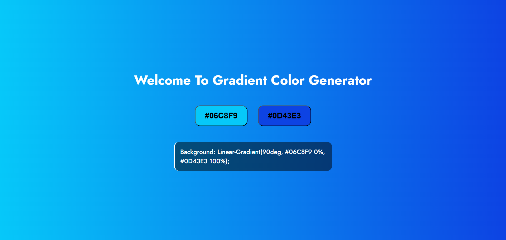

# gradient-color-generator
A simple and interactive web tool to generate beautiful CSS gradient backgrounds. Click to randomize colors and copy the CSS code instantly. Built using HTML, CSS, and JavaScript.

# 🌈 Gradient Color Generator

Welcome to the **Gradient Color Generator** — a simple and interactive web tool built using HTML, CSS, and JavaScript.

## 🚀 Features

- 🎨 Randomly generate two gradient colors
- 🔁 Instantly update the page background with the new gradient
- 📋 Click to copy the generated CSS gradient code
- 💡 Clean, responsive UI with custom fonts

## 📸 Demo

  

## 🔗 Visit Website

👉 [Click here to try it live](https://fenilbhalala.github.io/gradient-color-generator/)

## 🛠️ How It Works

1. Click on either color button to generate a random hex color.
2. The background and gradient code update instantly.
3. Click on the gradient code box to copy it to your clipboard.

## 💻 Tech Stack

- HTML5
- CSS3
- JavaScript
